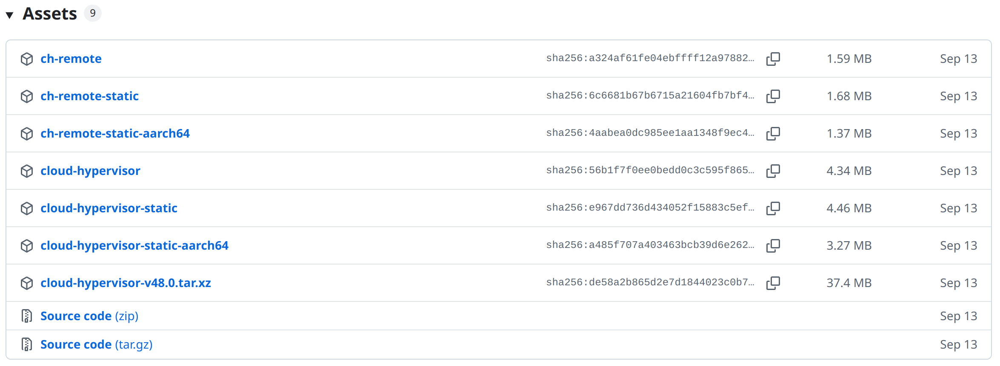

## 下载

github 下载地址:

https://github.com/cloud-hypervisor/cloud-hypervisor/releases/



### x86

x86平台下载:

```bash
mkdir -p ~/work/soft/cloudhypervisor/bin
cd ~/work/soft/cloudhypervisor/bin
wget https://github.com/cloud-hypervisor/cloud-hypervisor/releases/download/v49.0/ch-remote
wget https://github.com/cloud-hypervisor/cloud-hypervisor/releases/download/v49.0/cloud-hypervisor
wget https://github.com/cloud-hypervisor/cloud-hypervisor/releases/download/v49.0/ch-remote-static
wget https://github.com/cloud-hypervisor/cloud-hypervisor/releases/download/v49.0/cloud-hypervisor-static

chmod +x ./ch-remote
chmod +x ./cloud-hypervisor
chmod +x ./ch-remote-static
chmod +x ./cloud-hypervisor-static

# 验证一下版本
./cloud-hypervisor --version
./cloud-hypervisor-static --version
./ch-remote --version
./ch-remote-static --version
```

版本输出为:

```bash
$ ./cloud-hypervisor-static --version
cloud-hypervisor v49.0.0
$ ./cloud-hypervisor --version
[1]    10062 segmentation fault  ./cloud-hypervisor --version
$ ./ch-remote --version
ch-remote v49.0.0
$ ./ch-remote-static --version
ch-remote v49.0.0
```

cloud-hypervisor 不能用.这是因为带 static 的二进制文件是静态编译版本，所有依赖库都已经打包在可执行文件里；不带 static 的则是动态链接版本，运行时需要系统上存在相应的共享库。如果系统缺少或版本不匹配，就可能出现 segmentation fault。

方便起见,还是直接用 static 版本比较好.

```bash
mkdir -p ~/work/soft/cloudhypervisor/bin
cd ~/work/soft/cloudhypervisor/bin
wget https://github.com/cloud-hypervisor/cloud-hypervisor/releases/download/v49.0/ch-remote-static -O ch-remote
wget https://github.com/cloud-hypervisor/cloud-hypervisor/releases/download/v49.0/cloud-hypervisor-static -O cloud-hypervisor

chmod +x ./ch-remote
chmod +x ./cloud-hypervisor

# 验证一下版本
./cloud-hypervisor --version
./ch-remote --version
```

### arm64

类似,下载 cloud-hypervisor-static-aarch64 和 ch-remote-static-aarch64．

## 安装

将二进制文件所在的目录加入到 path 就可以了,这样用起来比较方便.

```bash
vi ~/.zshrc
```

加入内容:

```bash
# cloud hypervisor
export PATH="$PATH:$HOME/work/soft/cloudhypervisor/bin"
```

生效并检验:

```bash
source ~/.zshrc

ch-remote --version
cloud-hypervisor --version
```

## 升级

貌似只要直接覆盖原来版本的文件即可．


